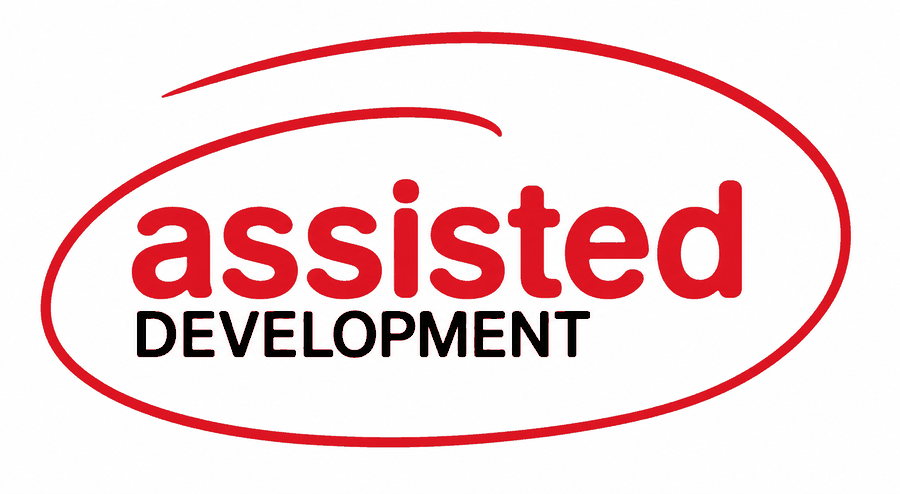

<!--
SPDX-FileCopyrightText: Simon A. F. Lund <os@safl.dk>

SPDX-License-Identifier: BSD-3-Clause
-->

<p align="center">
  <picture>
    <source media="(prefers-color-scheme: dark)" srcset="assets/logo-dark.png">
    
  </picture>
</p>

# assisted-development

[](https://github.com/xnvme/assisted-development/actions/workflows/format.yml)
[](https://github.com/xnvme/assisted-development/actions/workflows/test.yml)

Conventions and skills for assisted development.

Install them for yourself and they apply in every repository you work on,
including ones you have no say over. They hold the same for an agent and for the
person using one.

## What is here

- [`AGENTS.md`](AGENTS.md) states the conventions. It is the normative copy and
  the file an agent loads.
- [`skills/`](skills) holds the procedure: `review` checks a change that is
  checked out, yours before it leaves the machine or someone else's pull
  request, and posts the findings to that pull request when asked.
- [`install.py`](install.py) links the conventions and the skill into your agent
  configuration, and [`tests/`](tests) checks that it does, since it writes into
  your `$HOME`.
- [docs/practice.md](docs/practice.md) is the reasoning behind the conventions,
  written for people rather than for agents.

Licensing follows [REUSE](https://reuse.software): every file states its
copyright and license, `LICENSES/` holds the license texts, and `REUSE.toml`
covers the files that cannot carry a header.

## The expectation

**Assisted development, not vibe coding.** If you run an agent in your own
checkout with your own credentials, the commit is yours. You are the author, you
are accountable, and "the agent wrote it" is not available to you afterwards.

You must understand the change you are submitting. Not "it looked plausible and
the tests passed", but well enough to defend it in review, fix it when it breaks
at an inconvenient hour, and answer for it when someone else builds on it.

Three trailers, three separate jobs. The author line says who is answerable,
`Signed-off-by:` certifies provenance, and `Assisted-by:` discloses what helped.
Never `Co-Authored-By:` for an agent, since co-authorship would divide the first
job with something that cannot hold any part of it.

```
Assisted-by: Claude Code:claude-opus-5
Signed-off-by: Full Name <address>
```

The format follows the Linux kernel's [coding assistants
guidance](https://docs.kernel.org/process/coding-assistants.html). A trailer is
only worth having if the same name means the same thing everywhere.

## Installing it

Out of tree, on purpose. Nothing is added to the projects you work on, because
most of them are not yours to change and would not want your conventions
anyway. Clone this once and install it, and it applies in every repository you
touch.

```
git clone git@github.com:xnvme/assisted-development.git ~/git/assisted-development
cd ~/git/assisted-development
./install.py --dry-run     # see what it would do
./install.py
```

Everything it creates is a symlink back into the checkout, so `git pull`
updates every tool at once rather than leaving copies to drift, and
`./install.py --uninstall` leaves nothing behind. It never overwrites: a path
that already exists and is not one of its links is reported and left alone. The
one thing it removes uninvited is a link into the checkout whose target has
gone, which is what a renamed or deleted skill leaves behind.

```
~/.claude/rules/assisted-development.md -> AGENTS.md      (Claude Code)
~/.pi/agent/AGENTS.md                   -> AGENTS.md      (pi)
~/.claude/skills/<name>                 -> skills/<name>  (Claude Code)
~/.agents/skills/<name>                 -> skills/<name>  (Codex, Cursor, pi)
```

This is why the repository has no tool-specific files in it. The layout here is
the standard one, `AGENTS.md` and `skills/`, and the installer puts copies where
each tool insists on looking. Claude Code not reading `AGENTS.md` becomes its
problem rather than the repository's.

On native Windows without Developer Mode, symlink creation fails; the installer
says so, and copying the directories works at the cost of re-copying to update.

### For a team

What the team shares is this repository, and each person installs from it into
their own agent configuration. The practice is then common to everyone
regardless of which project they are working on, and it stays common without
anyone touching a project repository.

Changes propagate by `git pull`. If you would rather conventions changed
deliberately than whenever someone pushes, have people track a tag and move it
when you mean to.

Record who signs off in your own agent configuration, not in `AGENTS.md`. The
name is per person and `AGENTS.md` is the file everyone shares, so a name put
there is either one person's identity imposed on the team or gone at the next
`git pull`. For Claude Code it belongs in `~/.claude/CLAUDE.md`, which the
installer never touches:

```
The sign-off trailer names me: `Signed-off-by: Full Name <address>`.
```

Nothing here overrides a project. Where a project documents its own process,
that wins, and `AGENTS.md` says so in its opening lines. These are the defaults
for the many repositories that state nothing.

## Where each tool looks

The skills follow the [Agent Skills](https://agentskills.io) standard, so the
files are portable. Their locations are not, which is what the installer exists
to paper over:

- Claude Code reads only `.claude/skills/`, and this is not configurable. It
  does not read `AGENTS.md` at all; user-level rules in `.claude/rules/` are the
  way in.
- Codex reads only `.agents/skills/`.
- Cursor reads `.agents/skills/` and `.cursor/skills/`, with `.claude/skills/`
  and `.codex/skills/` for compatibility.
- Copilot reads `.github/skills/`, `.claude/skills/`, or `.agents/skills/`.
- pi reads `~/.agents/skills/` and `~/.pi/agent/skills/`, and is the only one
  that reads a global `AGENTS.md`, at `~/.pi/agent/AGENTS.md`.

Keep skill frontmatter to the spec's fields, which are `name`, `description`,
`license`, `compatibility`, `metadata`, and `allowed-tools`. Claude Code accepts
more, and every extra one quietly does nothing elsewhere.

## Working on this repository

`make format` runs the formatters and linters, including the REUSE check, and
`make test` runs the installer tests against a throwaway home directory. CI
runs both, so run both before pushing. `make` on its own lists every target.

## Out of scope

**Committing this into a project.** Possible for a repository you own: copy
`AGENTS.md` to the root and `skills/` to `.agents/skills/`, and for Claude Code
add a `CLAUDE.md` containing `@AGENTS.md` and a second copy of the skills in
`.claude/skills/`, the only place it reads them from. It binds every
contributor rather than the ones who installed it, at the cost of a copy per
project. Installing out of tree is the model here.

**Running an agent on its own account.** An agent with its own forge account
needs rules about who it is and what it may not do, which hold everywhere it
works rather than in any one project. That, and the accounts, credentials, and
machine behind it, belongs to a separate project. An agent set up that way
still follows these conventions; the dependency runs one way.

**The mistakes themselves.** Conventions bound how a mistake arrives and who
answers for it, and nothing more. The [lethal
trifecta](https://simonwillison.net/2025/Jun/16/the-lethal-trifecta/) lives in
how an agent is used rather than in how a project is configured, and
[docs/practice.md](docs/practice.md) is where that is covered. OWASP's [Top 10
for Agentic
Applications](https://genai.owasp.org/resource/agentic-ai-threats-and-mitigations/)
is the wider map, and its "Least Agency" principle is the argument for autonomy
being earned rather than default.
